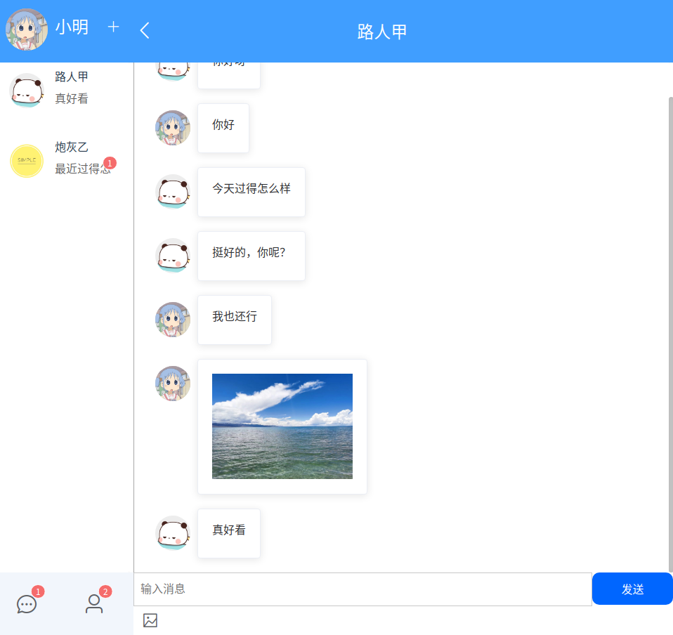
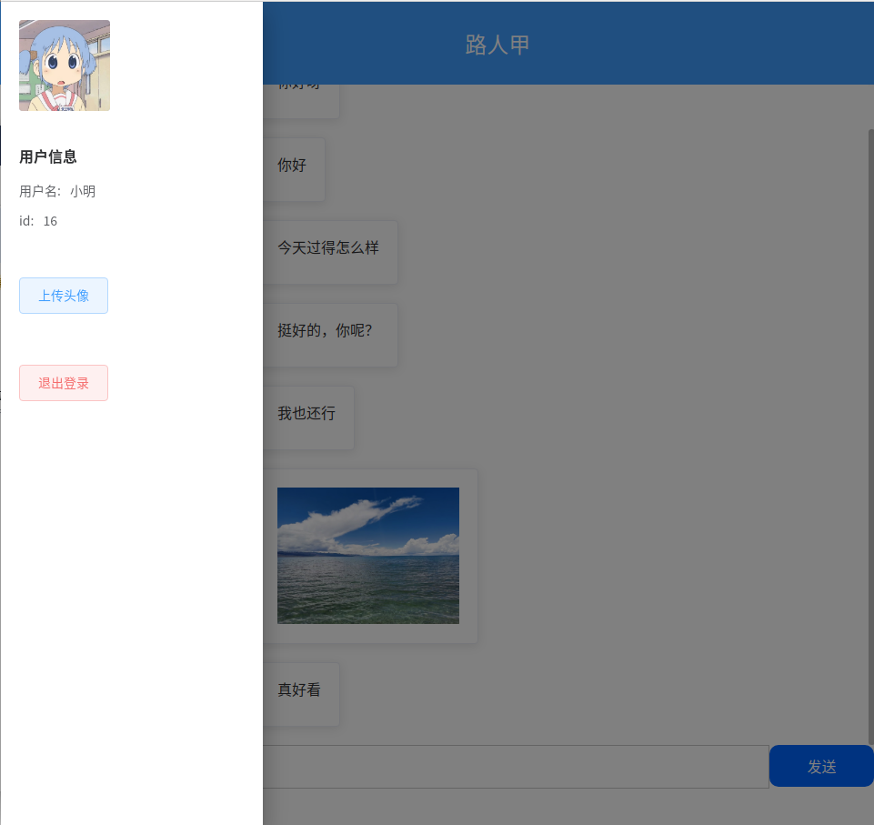
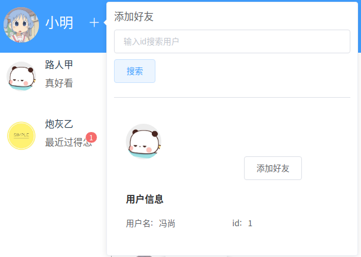
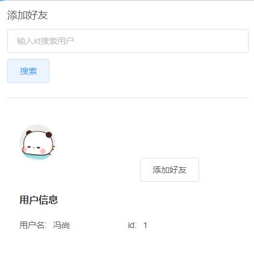

SimpleYou是基于SpringBoot+Vue的聊天室，具有以下特色：

尽可能友好的UI交互
消息本地化功能
支持图片传输

外观：











本地启动流程：

1 启动MongoDB，并新建数据库“FSIM”

```
use FSIM
```

2 执行MySQL相关库表创建

```mysql
create database if not exists FSIM;
use FSIM;
create table if not exists friend_applies
(
    id               int auto_increment comment 'id'
        primary key,
    apply_user_id    int      null,
    applied_user_id  int      null,
    accept_or_refuse int      null,
    create_time      datetime null
);
create table if not exists group_user_relation
(
    id          int auto_increment comment 'id'
        primary key,
    user_id     int         null,
    job         varchar(20) null,
    create_time datetime    null
);
create table if not exists user
(
    id          int auto_increment comment 'id'
        primary key,
    name        varchar(128) null,
    pwd         varchar(124) null,
    head_img    varchar(524) null,
    phone       varchar(64)  null,
    create_time datetime     null
);
create table if not exists user_group
(
    id          int auto_increment comment 'id'
        primary key,
    name        varchar(128) null,
    head_img    varchar(524) null,
    create_time datetime     null
);
create table if not exists user_relation
(
    id          int auto_increment comment 'id'
        primary key,
    user_id1    int      null,
    user_id2    int      null,
    relation    int      null,
    create_time datetime null
);
```

3 修改{project_dir}/java/src/main/resources/application.yml中的相关信息，填入mysql对应的用户名和密码

```
******
username: //mysql用户名
password: //mysql密码
******
```

4 启动后端java项目

5 如果需求图片功能，则需要修改前端vue项目中的相关配置信息

找到config.js并按照提示添加华为云OBS相关信息

```javascript
OBS_CONFIG = {
    // 华为云OBS相关配置
    access_key_id:'',// 你的ak
    secret_access_key: '',// 你的sk
    server: '',// 你的endPoint,
    avater_bucket_name: '',// 存放头像的桶名
    avater_bucket_url: '',//示例 'https://avater.obs.cn-north-1.myhuaweicloud.com/'
    message_bucket_name: '',// 存放聊天图片的桶名
    message_bucket_url: '',//示例 'https://message.obs.cn-north-1.myhuaweicloud.com/
}
```

6 加载前端项目依赖并启动前端项目

```shell
cd {project_dir}/vue
npm install -g cnpm -registry=https://registry.npm.taobao.org
cnpm install
cnpm run serve
```

7 启动完成

进入http://localhost:8080/#/login即可注册用户，此时便可以在本地体验项目。